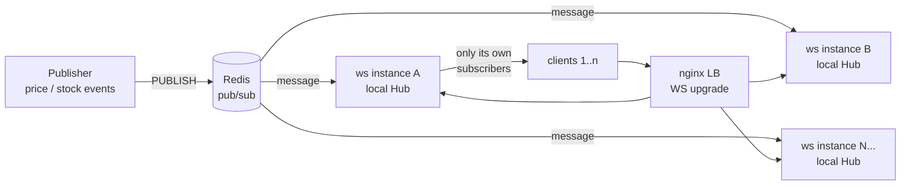

# WebSocket Scaling Lab

> How do you push real-time events to **tens of thousands of concurrent WebSocket clients** without one slow phone on a bad network taking the whole fleet down?
>
> A horizontally-scalable WebSocket fan-out architecture — Node.js + Redis pub/sub — with an explicit **backpressure policy**, dead-connection reaping, per-instance observability, and an honest end-to-end latency benchmark.

[](https://github.com/AbdouShalby/WebSocket-Scaling-Lab/actions)
[](https://nodejs.org/)
[](https://redis.io/)
[](LICENSE)

This lab is a distilled, reproducible version of the architecture behind a production real-time marketplace I built and operated (30k+ concurrent connections). Company code stays with the company — the engineering decisions are what this repo demonstrates.

---

## TL;DR

| Problem | Solution in this lab |
|---|---|
| One instance can't hold every socket | Stateless instances behind an LB; **Redis pub/sub** fans events out to all instances; each instance delivers only to its own subscribers |
| One slow client can OOM the server | **Backpressure policy**: drop frames for clients over a `bufferedAmount` threshold, disconnect after N consecutive drops — drops are counted, never silent |
| Mobile clients vanish without closing | **Heartbeat reaper**: ping/pong sweep terminates dead sockets every interval |
| "It's fast" is not a number | `bench/connect-storm.js` measures **publish → Redis → instance → client** latency: p50/p95/p99 across thousands of real connections |
| Deploys drop every connection | **Graceful drain** on SIGTERM: close frames to every client, then exit |

## Architecture



**Why this shape:** each instance is stateless with respect to its peers — it holds only its own sockets and a local `channel → subscribers` map. A published event hits Redis once and every instance once, and each instance fans out **only to its own subscribers of that channel** (O(subscribers), not O(connections)). Scaling out = `--scale ws=8`. No sticky-session state to migrate, no inter-instance mesh.

## Run it

```bash
# fleet: 4 ws instances + nginx + redis + a publisher pushing 50 ev/s
docker compose up --build --scale ws=4

# in another terminal: open 5,000 connections and measure E2E latency
npm ci
node bench/connect-storm.js --url ws://localhost:8080 --conns 5000 --channels 20 --measure 30
```

### Measured results

Single instance + Redis (WSL2), publisher at 50 ev/s × 20 channels — **AMD Ryzen 7 5800X (8c/16t), 24 GB RAM, Windows 11**:

```
══════════ RESULTS ══════════
connections opened : 5000/5000 (0 failed)
ramp time          : 5.6s
events received    : 404460            → ~13,500 deliveries/sec sustained
E2E latency  p50   : 155 ms
             p95   : 317 ms
             p99   : 365 ms
             max   : 404 ms
```

> The benchmark measures **true end-to-end latency** — from the publisher's timestamp, through Redis, through the instance, to client receive — not server-side send times. Two honesty notes: (1) the single-process bench client holds all 5,000 sockets itself on the same machine, so these figures *include* client-side receive queuing — per-client latency in a real deployment is lower; (2) run it on your own hardware (`npm run bench`) — your numbers will differ, and that's the point.

Watch the fleet while it runs:

```bash
curl -s localhost:8080/metrics | jq   # hits one instance through the LB
```

```json
{
  "instance": "d1f3a9c2b4e5",
  "uptimeSeconds": 124,
  "connectionsTotal": 1257,
  "delivered": 94210,
  "dropped": 312,
  "reapedConnections": 4,
  "hub": { "channels": 20, "connections": 1253, "slowConsumersKicked": 1 }
}
```

## The interesting parts

### Backpressure — the part most demos skip

`ws` exposes `socket.bufferedAmount`: bytes queued in userland that the kernel hasn't accepted yet. A client on a congested link makes that number grow — and every broadcast you `send()` to it is memory you can never reclaim until the client drains. At 30k connections, a few hundred slow consumers without a policy = OOM.

The policy in [`src/hub.js`](src/hub.js):

1. `bufferedAmount > MAX_BUFFERED_BYTES` → **drop** the frame for that client (real-time data ages instantly; a stale price update is worthless anyway)
2. `DROP_LIMIT` consecutive drops → **disconnect** the client; let it reconnect on a better link
3. every drop and kick is **counted and exported** — degradation must be visible

### Fan-out cost model

Serialization happens **once per broadcast**, not once per recipient (`JSON.stringify` before the subscriber loop). Channel registry is `Map<channel, Set<socket>>` — delivery cost is proportional to the channel's audience, never to total fleet connections.

### What's deliberately NOT here

| Omitted | Why |
|---|---|
| Redis Streams / Kafka | Pub/sub is fire-and-forget: disconnected clients miss events. Right trade-off for ephemeral data (prices, presence). If clients must catch up after reconnect, you need Streams + per-client cursors — different lab. |
| Message ACKs / delivery guarantees | Same reason: this models at-most-once ephemeral fan-out, and says so, instead of pretending to be exactly-once. |
| `perMessageDeflate` | CPU per frame hurts p99 at high connection counts; payloads here are ~100B JSON. Measured trade-off, not an oversight. |
| Sticky sessions | Nothing is session-bound; any instance can serve any client. That's the point. |

### Failure modes, honestly

- **Redis is a SPOF here.** Production answer: Redis Sentinel/Cluster, or a broker per shard. The lab keeps one node so the fan-out logic stays legible.
- **Pub/sub delivery is at-most-once.** A client that reconnects lost the events published while it was away — acceptable for tickers/presence, unacceptable for chat history.
- **Clock skew** breaks the benchmark's E2E numbers if publisher and bench run on different unsynced machines (compose setup shares the host clock).

## Client protocol

```jsonc
// → server
{ "action": "subscribe",   "channel": "product:42" }
{ "action": "unsubscribe", "channel": "product:42" }
{ "action": "ping", "t": 1699999999999 }

// ← server
{ "type": "subscribed", "channel": "product:42" }
{ "type": "event", "channel": "product:42", "data": { "price": 49.9 }, "publishedAt": 1699999999999 }
```

## Tests

```bash
npm test          # unit tests for the Hub (fan-out, backpressure, reaping) — no infra needed
                  # + E2E test (real server, real Redis, real client) — auto-skips without Redis
```

CI runs both against a Redis service container on every push.

## Project layout

```
src/
  server.js      HTTP + WS server, Redis subscriber, heartbeats, graceful drain
  hub.js         subscription registry + fan-out + backpressure policy (pure logic, unit-tested)
  publisher.js   simulated marketplace event source (rate/channels/duration flags)
  metrics.js     dependency-free counters behind /metrics
  config.js      every knob as an env var
bench/
  connect-storm.js   N-connection E2E latency benchmark
load-tests/
  k6-ws-test.js      connection-churn soak test (ramping VUs)
tests/
  hub.test.js        unit tests (node:test, zero deps)
  e2e.test.js        full-stack smoke test
```

## Related work

- [Distributed-Order-Processing-System](https://github.com/AbdouShalby/Distributed-Order-Processing-System) — the transactional side: Redis distributed locks, idempotency, queue workers (Laravel)
- [Distributed-Locking-Deep-Dive-Lab](https://github.com/AbdouShalby/Distributed-Locking-Deep-Dive-Lab) — race conditions, deadlocks, TTL edge cases under the microscope
- [Backend-Architecture-Case-Studies](https://github.com/AbdouShalby/Backend-Architecture-Case-Studies) — system design write-ups incl. a 100k QPS notification fan-out design

## License

[MIT](LICENSE)
