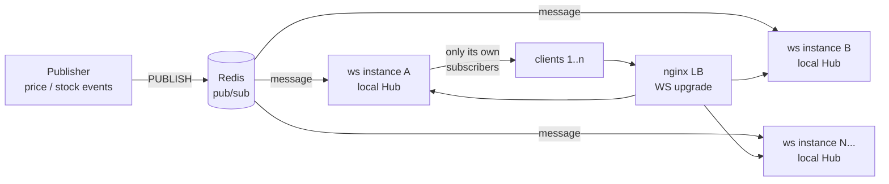

# WebSocket Scaling Lab

> A production-inspired lab for WebSocket fan-out, backpressure, and reproducible measurement.
>
> A horizontally-scalable WebSocket fan-out architecture — Node.js + Redis pub/sub — with an explicit **backpressure policy**, dead-connection reaping, per-instance observability, and an honest end-to-end latency benchmark.

[](https://github.com/AbdouShalby/WebSocket-Scaling-Lab/actions)
[](https://nodejs.org/)
[](https://redis.io/)
[](LICENSE)

This repository demonstrates engineering decisions using simulated events. It does not establish production usage or 30k connection capacity. Evidence covers local Hub policies, a one-server Redis/WebSocket path, real two-process fan-out (WS-1B), and controlled same-host 1/2/4-process benchmark curves (WS-1C). These curves are finite offered-load measurements, not proof of a capacity ceiling or production scaling gains.

**Start here:** [reproduce the full validation](docs/reproduce.md), [evidence index and claim boundaries](docs/evidence/README.md), [WS-4 finalization audit](docs/ws-4.md).
WS-2 adds bounded failure/recovery experiments; WS-3 adds ingress guards, subscriber readiness and per-process telemetry. The retained performance curves describe the WS-1C snapshot, not a fresh capacity measurement of WS-3/WS-4.

---

## TL;DR

| Problem | Solution in this lab |
|---|---|
| Distribute local socket ownership | Independent instances with local subscription state; **Redis pub/sub** feeds connected subscribers; nginx is an optional, unmeasured topology |
| Slow clients create memory pressure | **Backpressure policy**: drop frames over a `bufferedAmount` threshold, disconnect after N consecutive drops; counters expose this policy, not a total memory bound |
| Mobile clients vanish without closing | **Heartbeat reaper**: ping/pong sweep terminates dead sockets every interval |
| Performance needs a defined workload | Controlled benchmark publications, acknowledged subscriptions, an isolated measurement window, and versioned result artifacts |
| Process termination | SIGTERM sends close frames to every client, then exits; connection-preserving deployment is not proven |

## Architecture


```mermaid
flowchart LR
    P[Publisher\nprice / stock events] -->|PUBLISH| R[(Redis\npub/sub)]
    R -->|message| A[ws instance A\nlocal Hub]
    R -->|message| B[ws instance B\nlocal Hub]
    R -->|message| C[ws instance N...\nlocal Hub]
    LB[nginx LB\nWS upgrade] --> A & B & C
    CL1[clients 1..n] --> LB
    A -->|only its own\nsubscribers| CL1
```

**Why this shape:** each instance owns its sockets and a local `channel → subscribers` map. Healthy Redis subscribers receive publications and fan out **only to their own subscribers of that channel**. Disconnected instances can miss events. There is no inter-instance mesh or session migration; reconnecting clients must explicitly resubscribe. Compose can configure replicas, but the retained experiments use direct process ports, not nginx routing or dynamic service discovery.

## Run it

```bash
# Start Redis for the local single-server methodology check.
docker compose up -d redis
npm ci
node bench/run-local.js --conns 12 --channels 3 --rate 30 --measure 2
```

`run-local` starts one server, waits for its Redis subscription, captures its actual runtime/configuration, and stops that server after the run. Redis must already be reachable. The benchmark owns its publisher and isolated logical channels; the demo publisher is not part of this workload. Routine timestamped JSON/log files go to ignored `bench/results/`.

### Benchmark methodology and evidence

WS-1A repairs measurement integrity. See [methodology, options, and validation](docs/ws-1a.md).
Each run waits for every subscription acknowledgment, warms up, resets counters, measures, then drains separately.
Expected deliveries come from the issued-event ledger, including publications that nobody received.
Throughput counts unique deliveries received inside the actual measurement window; late and duplicate deliveries do not inflate it.
Latency uses the same controller's monotonic clock immediately before Redis publish and upon client receipt, excluding warmup and drain.

The old July 12 results (5k/10k connection attempts, claimed ~13.5k/~32.8k deliveries/sec, and associated latency percentiles) are **historical/unverified**. They remain in Git history at `17f3771` and `e8648b4`. Counters and samples included ramp traffic while the throughput denominator used only 30 seconds. Raw evidence and exact runtime metadata were not retained. These numbers are withdrawn as capacity/CV evidence; neither a single-node ceiling nor scaling improvement was established.

The Compose fleet remains an implementation topology. WS-1A does not run or prove multi-node scaling. The retained small one-server validation is methodology evidence, not a capacity benchmark.

### Two-instance correctness proof

```bash
# Requires real Redis; starts and stops its own two Node server processes.
npm run proof:two-node -- --redis-port 6379
```

[WS-1B methodology and retained evidence](docs/ws-1b.md) demonstrate six simultaneously open real WebSocket connections, split deterministically between two independent ports/processes. Shared-channel fan-out, private-channel isolation, unsubscribe and repeat subscribe produce exactly the 13 expected client/event receipts during bounded observation windows. Two real-server negative controls ensure missing and duplicate fan-out fail the proof. This is same-host correctness evidence, not a throughput, nginx routing, failover or multi-host experiment.

### 1 / 2 / 4 process benchmark curves

```bash
npm run bench:scaling -- --redis-port 6379 --connections 240,1200,2400 --ramp 50
```

[WS-1C methodology, curves and raw evidence](docs/ws-1c.md) compare the same total workload across 1, 2 and 4 independent server processes: 240/1200/2400 total connections, 12 channels, a target 120 source events/sec, 15-second measurement windows, and three repetitions with rotated topology order. Every trial uses a fresh controller and server fleet, direct balanced client assignment, and real Redis. All repetitions are retained; tables and graphs show median and observed min/max rather than selecting the fastest run. The earlier 4800-client attempt failed the bounded delivery check and is retained separately, not presented as successful capacity evidence.

Compare **actual issued rate** alongside received throughput and p95/p99. The controller, servers and Redis share one machine; neither resource saturation nor multi-host speedup is established. The short CI matrix validates the harness, not capacity.

### Failure/recovery and operational evidence

[WS-2 scenarios, evidence and limitations](docs/ws-2.md) exercise real POSIX Redis kill/restart, WebSocket process failure with a surviving peer, cooperative SIGTERM (close 1001 / exit 0), a non-cooperating peer reaching the forced shutdown deadline (exit 1), and real TCP slow-reader backpressure with healthy-client continuity. Client reconnect/resubscribe and replacement process starts are explicit harness actions, not automatic application features. Gap events are not replayed.

```bash
# Linux/WSL, Node and real redis-server required; owns isolated temporary processes.
npm run test:ws2
npm run proof:operations
```

No application source change was needed for WS-2. `/healthz` reports liveness even during Redis outage; WS-3 adds a separate readiness check below. These are bounded production-inspired experiments, not lossless-deployment, arbitrary-crash or production-recovery guarantees.

### Security, readiness and operational telemetry

[WS-3 contracts, tests and evidence](docs/ws-3.md) cover malformed-input crash prevention,
exact optional Origin checks, per-connection message limits, and real subscriber
readiness across unavailable startup, denied SUBSCRIBE, Redis outage/stall/recovery
and SIGTERM. `/readyz` returns 503 until the current Redis subscription is acknowledged;
new upgrades also fail 503 while unready/draining. Existing connections do not gain
durable replay. `/metrics` exposes per-process state/counters and event-loop telemetry,
not receipt acknowledgments or fleet-level SLOs.

Direct startup binds loopback by default; Compose publishes only loopback ports.
`ALLOWED_ORIGINS` is optional for local benchmarks and **is not authentication**.
There is no user/channel authorization, TLS termination or DDoS protection. Keep
simulated events and metrics on a trusted local network; this is not a public-ready
security deployment. See WS-3 for exact configuration and limitations.

```bash
npm run test:ws3     # Linux/WSL; owned real Redis and server processes; no skip
npm run proof:guards # versioned security/readiness/telemetry evidence
```

Watch the fleet while it runs:

The following JSON is an illustrative excerpt of server telemetry. Server `delivered` counts
send calls; the WS-1A benchmark counts actual client receipts independently.

```bash
curl -s localhost:8080/metrics | jq   # hits one instance through the LB
```

```json
{
  "instance": "d1f3a9c2b4e5",
  "uptimeSeconds": 124,
  "connectionsTotal": 1257,
  "delivered": 94210,
  "dropped": 312,
  "reapedConnections": 4,
  "hub": { "channels": 20, "connections": 1253, "slowConsumersKicked": 1 }
}
```

## The interesting parts

### Backpressure — the part most demos skip

`ws` exposes `socket.bufferedAmount`: queued outbound bytes. A congested client can accumulate buffered frames, creating memory pressure. WS-2 demonstrates drops and eviction using a genuinely paused TCP reader and explicit low test thresholds while a healthy client continues. It does not establish a whole-process memory bound, leak-free operation or Internet-congestion performance.

The policy in [`src/hub.js`](src/hub.js):

1. `bufferedAmount > MAX_BUFFERED_BYTES` → **drop** the frame for that client (this lab chooses loss-tolerant simulated events; suitability depends on the application)
2. `DROP_LIMIT` consecutive drops → **disconnect** the client; let it reconnect on a better link
3. every drop and kick is **counted and exported** — degradation must be visible

### Fan-out cost model

Serialization happens **once per broadcast**, not once per recipient (`JSON.stringify` before the subscriber loop). Channel registry is `Map<channel, Set<socket>>` — delivery cost is proportional to the channel's audience, never to total fleet connections.

### What's deliberately NOT here

| Omitted | Why |
|---|---|
| Redis Streams / Kafka | Disconnected clients miss events. Replay would require a different persistence and client-cursor design, outside this lab. |
| Message ACKs / delivery guarantees | Same reason: this models at-most-once ephemeral fan-out, and says so, instead of pretending to be exactly-once. |
| `perMessageDeflate` | Disabled as a design choice for small payloads; no compression A/B benchmark is retained. |
| Sticky sessions / session migration | Connections and subscriptions are process-local. A new connection can use another ready instance but must resubscribe; no session migration is implemented or tested. |

### Failure modes, honestly

- **Redis is a SPOF here.** A single Redis process is a deliberate lab boundary. Broker high availability, sharding and multi-host recovery are not implemented or validated.
- **Pub/sub delivery is at-most-once.** Reconnecting clients cannot recover gap events through this protocol. Loss tolerance is a workload assumption, not a recommendation for real financial or durable messaging data.
- **Measurement overhead:** the WS-1A controller publishes and receives on one monotonic clock, including its own event-loop queuing. It does not isolate server-only latency or establish results for a distributed load generator.

## Client protocol

```jsonc
// → server
{ "action": "subscribe",   "channel": "product:42" }
{ "action": "unsubscribe", "channel": "product:42" }
{ "action": "ping", "t": 1699999999999 }

// ← server (event excerpt; actual envelopes also include relayedBy and relayedAt)
{ "type": "subscribed", "channel": "product:42" }
{ "type": "event", "channel": "product:42", "data": { "price": 49.9 }, "publishedAt": 1699999999999 }
```

## Tests

```bash
npm run validate  # full POSIX suite; owns Redis; fails on any skip; retains JSON + TAP
npm run verify:evidence # read-only archive integrity + matrix recomputation; no Redis
npm test          # Hub + benchmark + guards; legacy E2E auto-skips without Redis
npm run test:ws1a # mandatory real Redis + one-server benchmark/CLI validation; no skip
npm run test:ws1b # mandatory real Redis + two-process proof and negative controls; no skip
npm run test:ws1c # mandatory real Redis + short 1/2/4-process matrix; not a capacity test
npm run test:ws2  # POSIX only; owns real Redis/processes; operational scenarios + negative controls
npm run test:ws3  # POSIX only; real security/readiness/telemetry proof + negative controls
```

CI is configured to run `npm test` and the WS-1A/B/C commands against a Redis service container, the archive/tooling checks without Redis, and WS-2/WS-3 in a separate Linux job with owned ephemeral Redis processes. `npm run validate` is the single-command local gate over every test file, including the same real-infrastructure and negative-control tests; it rejects skips. CI uploads generated validation artifacts. A local pass is not a claim that remote CI has run. WS-2 covers the documented close/deadline scenarios, not rolling deployments or full heartbeat-failure coverage.

`load-tests/k6-ws-test.js` is an **unvalidated optional churn script**, not part of the evidence gate. No retained k6 run proves its timing thresholds. Its HTTP 101 check has no `checks` failure threshold, and it has no exact per-client delivery ledger; its counters cannot substitute for the controlled benchmark.

## Project layout

```
src/
  server.js      HTTP + WS server, Redis subscriber, heartbeats, graceful drain
  hub.js         subscription registry + fan-out + backpressure policy (pure logic, unit-tested)
  publisher.js   simulated marketplace event source (rate/channels/duration flags)
  metrics.js     dependency-free counters behind /metrics
  config.js      every knob as an env var
  protocol.js    ingress shape validation and per-connection token bucket
  readiness.js   ACK-aware subscriber readiness, health checks and drain state
bench/
  connect-storm.js   existing-target CLI + versioned result/provenance artifacts
  run-local.js       one-server launcher with captured runtime metadata
  prove-two-node.js  two-process Redis fan-out proof + per-client receipt artifacts
  run-fleet.js       1/2/4-process measured trial with exact target/relay checks
  run-scaling.js     repeatable fixed-total-workload matrix, fresh trial processes
  scaling-report.js  validated aggregation and generated same-host curves
  operational-lab.js owned POSIX Redis/server/socket test resources and receipt ledger
  prove-operations.js real operational scenarios and versioned evidence
  prove-guards.js     real WS-3 security/readiness/telemetry scenarios and evidence
  runner.js          acknowledged lifecycle + controlled publisher
  accounting.js      exact per-event/per-client delivery ledger
  options.js         bounded workload and runtime metadata validation
load-tests/
  k6-ws-test.js      optional unvalidated connection-churn script (ramping VUs)
scripts/
  validate.js       full POSIX suite with owned Redis, zero-skip gate and raw evidence
  verify-evidence.js read-only archive hashes and WS-1C table/curve recomputation
tests/
  hub.test.js        unit tests (node:test, zero deps)
  e2e.test.js        full-stack smoke test
  benchmark.test.js  accounting regressions + real-socket/test-publisher fixtures
  benchmark-integration.test.js  mandatory real Redis + one server + CLI artifacts
  two-node.test.js   mandatory real Redis + two servers + negative controls
  scaling.test.js    matrix/routing/aggregation regressions
  scaling-integration.test.js   real 1/2/4-process short matrix + negative control
  operations.test.js real POSIX failure/recovery scenarios + targeted negative controls
  guards.test.js     deterministic validation/rate/readiness/config regressions
  guards-integration.test.js real WS-3 scenarios + four negative controls
  showcase.test.js   archive integrity and fail-closed validation-summary regressions
  fixtures/ws3-mutant.cjs       explicit in-memory WS-3 negative controls
  fixtures/ws2-mutant.cjs       explicit in-memory operational negative controls
  fixtures/ws1b-mutant.cjs       explicit test-only in-memory mutation preload
```

## Related work

These are navigation links, not evidence audited by this repository:

- [Distributed-Order-Processing-System](https://github.com/AbdouShalby/Distributed-Order-Processing-System)
- [Distributed-Locking-Deep-Dive-Lab](https://github.com/AbdouShalby/Distributed-Locking-Deep-Dive-Lab)
- [Backend-Architecture-Case-Studies](https://github.com/AbdouShalby/Backend-Architecture-Case-Studies)

## License

[MIT](LICENSE)
