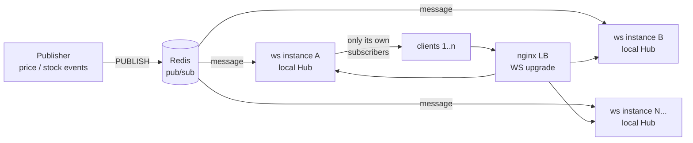

# WebSocket Scaling Lab

> A production-inspired lab for WebSocket fan-out, backpressure, and reproducible measurement.
>
> A horizontally-scalable WebSocket fan-out architecture — Node.js + Redis pub/sub — with an explicit **backpressure policy**, dead-connection reaping, per-instance observability, and an honest end-to-end latency benchmark.

[](https://github.com/AbdouShalby/WebSocket-Scaling-Lab/actions)
[](https://nodejs.org/)
[](https://redis.io/)
[](LICENSE)

This repository demonstrates engineering decisions using simulated events. It does not establish production usage or 30k connection capacity. Evidence covers local Hub policies, a one-server Redis/WebSocket path, real two-process fan-out (WS-1B), and controlled same-host 1/2/4-process benchmark curves (WS-1C). These curves are finite offered-load measurements, not proof of a capacity ceiling or production scaling gains.

---

## TL;DR

| Problem | Solution in this lab |
|---|---|
| One instance can't hold every socket | Stateless instances behind an LB; **Redis pub/sub** fans events out to all instances; each instance delivers only to its own subscribers |
| One slow client can OOM the server | **Backpressure policy**: drop frames for clients over a `bufferedAmount` threshold, disconnect after N consecutive drops — drops are counted, never silent |
| Mobile clients vanish without closing | **Heartbeat reaper**: ping/pong sweep terminates dead sockets every interval |
| Performance needs a defined workload | Controlled benchmark publications, acknowledged subscriptions, an isolated measurement window, and versioned result artifacts |
| Process termination | SIGTERM sends close frames to every client, then exits; connection-preserving deployment is not proven |

## Architecture


```mermaid
flowchart LR
    P[Publisher\nprice / stock events] -->|PUBLISH| R[(Redis\npub/sub)]
    R -->|message| A[ws instance A\nlocal Hub]
    R -->|message| B[ws instance B\nlocal Hub]
    R -->|message| C[ws instance N...\nlocal Hub]
    LB[nginx LB\nWS upgrade] --> A & B & C
    CL1[clients 1..n] --> LB
    A -->|only its own\nsubscribers| CL1
```

**Why this shape:** each instance is stateless with respect to its peers — it holds only its own sockets and a local `channel → subscribers` map. A published event hits Redis once and every instance once, and each instance fans out **only to its own subscribers of that channel** (O(subscribers), not O(connections)). Scaling out = `--scale ws=8`. No sticky-session state to migrate, no inter-instance mesh.

## Run it

```bash
# Start Redis for the local single-server methodology check.
docker compose up -d redis
npm ci
node bench/run-local.js --conns 12 --channels 3 --rate 30 --measure 2
```

`run-local` starts one server, waits for its Redis subscription, captures its actual runtime/configuration, and stops that server after the run. Redis must already be reachable. The benchmark owns its publisher and isolated logical channels; the demo publisher is not part of this workload. Routine timestamped JSON/log files go to ignored `bench/results/`.

### Benchmark methodology and evidence

WS-1A repairs measurement integrity. See [methodology, options, and validation](docs/ws-1a.md).
Each run waits for every subscription acknowledgment, warms up, resets counters, measures, then drains separately.
Expected deliveries come from the issued-event ledger, including publications that nobody received.
Throughput counts unique deliveries received inside the actual measurement window; late and duplicate deliveries do not inflate it.
Latency uses the same controller's monotonic clock immediately before Redis publish and upon client receipt, excluding warmup and drain.

The old July 12 results (5k/10k connection attempts, claimed ~13.5k/~32.8k deliveries/sec, and associated latency percentiles) are **historical/unverified**. They remain in Git history at `17f3771` and `e8648b4`. Counters and samples included ramp traffic while the throughput denominator used only 30 seconds. Raw evidence and exact runtime metadata were not retained. These numbers are withdrawn as capacity/CV evidence; neither a single-node ceiling nor scaling improvement was established.

The Compose fleet remains an implementation topology. WS-1A does not run or prove multi-node scaling. The retained small one-server validation is methodology evidence, not a capacity benchmark.

### Two-instance correctness proof

```bash
# Requires real Redis; starts and stops its own two Node server processes.
npm run proof:two-node -- --redis-port 6379
```

[WS-1B methodology and retained evidence](docs/ws-1b.md) demonstrate six simultaneously open real WebSocket connections, split deterministically between two independent ports/processes. Shared-channel fan-out, private-channel isolation, unsubscribe and repeat subscribe produce exactly the 13 expected client/event receipts during bounded observation windows. Two real-server negative controls ensure missing and duplicate fan-out fail the proof. This is same-host correctness evidence, not a throughput, nginx routing, failover or multi-host experiment.

### 1 / 2 / 4 process benchmark curves

```bash
npm run bench:scaling -- --redis-port 6379 --connections 240,1200,2400 --ramp 50
```

[WS-1C methodology, curves and raw evidence](docs/ws-1c.md) compare the same total workload across 1, 2 and 4 independent server processes: 240/1200/2400 total connections, 12 channels, a target 120 source events/sec, 15-second measurement windows, and three repetitions with rotated topology order. Every trial uses a fresh controller and server fleet, direct balanced client assignment, and real Redis. All repetitions are retained; tables and graphs show median and observed min/max rather than selecting the fastest run. The earlier 4800-client attempt failed the bounded delivery check and is retained separately, not presented as successful capacity evidence.

Compare **actual issued rate** alongside received throughput and p95/p99. The controller, servers and Redis share one machine; neither resource saturation nor multi-host speedup is established. The short CI matrix validates the harness, not capacity. Failure/recovery experiments remain WS-2 work and have not started.

Watch the fleet while it runs:

The following JSON is illustrative server telemetry. Server `delivered` counts
send calls; the WS-1A benchmark counts actual client receipts independently.

```bash
curl -s localhost:8080/metrics | jq   # hits one instance through the LB
```

```json
{
  "instance": "d1f3a9c2b4e5",
  "uptimeSeconds": 124,
  "connectionsTotal": 1257,
  "delivered": 94210,
  "dropped": 312,
  "reapedConnections": 4,
  "hub": { "channels": 20, "connections": 1253, "slowConsumersKicked": 1 }
}
```

## The interesting parts

### Backpressure — the part most demos skip

`ws` exposes `socket.bufferedAmount`: queued outbound bytes. A congested client can accumulate buffered frames, creating memory pressure. The lab makes the drop/disconnect policy explicit; a real slow-network memory experiment remains future work.

The policy in [`src/hub.js`](src/hub.js):

1. `bufferedAmount > MAX_BUFFERED_BYTES` → **drop** the frame for that client (real-time data ages instantly; a stale price update is worthless anyway)
2. `DROP_LIMIT` consecutive drops → **disconnect** the client; let it reconnect on a better link
3. every drop and kick is **counted and exported** — degradation must be visible

### Fan-out cost model

Serialization happens **once per broadcast**, not once per recipient (`JSON.stringify` before the subscriber loop). Channel registry is `Map<channel, Set<socket>>` — delivery cost is proportional to the channel's audience, never to total fleet connections.

### What's deliberately NOT here

| Omitted | Why |
|---|---|
| Redis Streams / Kafka | Pub/sub is fire-and-forget: disconnected clients miss events. Right trade-off for ephemeral data (prices, presence). If clients must catch up after reconnect, you need Streams + per-client cursors — different lab. |
| Message ACKs / delivery guarantees | Same reason: this models at-most-once ephemeral fan-out, and says so, instead of pretending to be exactly-once. |
| `perMessageDeflate` | Disabled as a design choice for small payloads; no compression A/B benchmark is retained. |
| Sticky sessions | Nothing is session-bound; any instance can serve any client. That's the point. |

### Failure modes, honestly

- **Redis is a SPOF here.** Production answer: Redis Sentinel/Cluster, or a broker per shard. The lab keeps one node so the fan-out logic stays legible.
- **Pub/sub delivery is at-most-once.** A client that reconnects lost the events published while it was away — acceptable for tickers/presence, unacceptable for chat history.
- **Measurement overhead:** the WS-1A controller publishes and receives on one monotonic clock, including its own event-loop queuing. It does not isolate server-only latency or establish results for a distributed load generator.

## Client protocol

```jsonc
// → server
{ "action": "subscribe",   "channel": "product:42" }
{ "action": "unsubscribe", "channel": "product:42" }
{ "action": "ping", "t": 1699999999999 }

// ← server
{ "type": "subscribed", "channel": "product:42" }
{ "type": "event", "channel": "product:42", "data": { "price": 49.9 }, "publishedAt": 1699999999999 }
```

## Tests

```bash
npm test          # Hub + benchmark regression tests; legacy E2E auto-skips without Redis
npm run test:ws1a # mandatory real Redis + one-server benchmark/CLI validation; no skip
npm run test:ws1b # mandatory real Redis + two-process proof and negative controls; no skip
npm run test:ws1c # mandatory real Redis + short 1/2/4-process matrix; not a capacity test
```

CI is configured to run all four commands against a Redis service container on main pushes and pull requests. Benchmark regression fixtures are explicitly distinguished from the real Redis validation. CI uploads generated validation artifacts. A local pass is not a claim that remote CI has run. Heartbeat and deployment-drain experiments remain outside WS-1A/WS-1B/WS-1C.

## Project layout

```
src/
  server.js      HTTP + WS server, Redis subscriber, heartbeats, graceful drain
  hub.js         subscription registry + fan-out + backpressure policy (pure logic, unit-tested)
  publisher.js   simulated marketplace event source (rate/channels/duration flags)
  metrics.js     dependency-free counters behind /metrics
  config.js      every knob as an env var
bench/
  connect-storm.js   existing-target CLI + versioned result/provenance artifacts
  run-local.js       one-server launcher with captured runtime metadata
  prove-two-node.js  two-process Redis fan-out proof + per-client receipt artifacts
  run-fleet.js       1/2/4-process measured trial with exact target/relay checks
  run-scaling.js     repeatable fixed-total-workload matrix, fresh trial processes
  scaling-report.js  validated aggregation and generated same-host curves
  runner.js          acknowledged lifecycle + controlled publisher
  accounting.js      exact per-event/per-client delivery ledger
  options.js         bounded workload and runtime metadata validation
load-tests/
  k6-ws-test.js      connection-churn soak test (ramping VUs)
tests/
  hub.test.js        unit tests (node:test, zero deps)
  e2e.test.js        full-stack smoke test
  benchmark.test.js  accounting regressions + real-socket/test-publisher fixtures
  benchmark-integration.test.js  mandatory real Redis + one server + CLI artifacts
  two-node.test.js   mandatory real Redis + two servers + negative controls
  scaling.test.js    matrix/routing/aggregation regressions
  scaling-integration.test.js   real 1/2/4-process short matrix + negative control
  fixtures/ws1b-mutant.cjs       explicit test-only in-memory mutation preload
```

## Related work

- [Distributed-Order-Processing-System](https://github.com/AbdouShalby/Distributed-Order-Processing-System) — the transactional side: Redis distributed locks, idempotency, queue workers (Laravel)
- [Distributed-Locking-Deep-Dive-Lab](https://github.com/AbdouShalby/Distributed-Locking-Deep-Dive-Lab) — race conditions, deadlocks, TTL edge cases under the microscope
- [Backend-Architecture-Case-Studies](https://github.com/AbdouShalby/Backend-Architecture-Case-Studies) — system design write-ups incl. a 100k QPS notification fan-out design

## License

[MIT](LICENSE)
