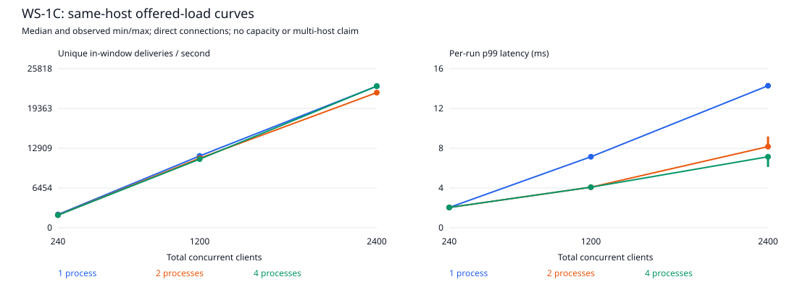

# WS-1C: same-host 1 / 2 / 4 process benchmark curves

Historical milestone snapshot. For current validation and claim boundaries, see [reproduction](reproduce.md) and the [evidence index](evidence/README.md).

## Read-only audit and plan

Baseline: clean `main` at `842bdd95ab9972c8dd62e259ef95c7175f3fd90f`.
WS-1A provides bounded, acknowledgment-gated measurement and exact client/event
accounting. WS-1B proves two independent server processes but does not measure
scaling. The runner currently has one target URL. No application rewrite,
dependency addition or server feature is needed.

Extend the existing runner with explicit target identity and deterministic
channel-balanced routing; keep its lifecycle, clocks and ledger. Launch fresh
1/2/4-server fleets, verify live identities and exact Redis subscriber counts,
then retain each trial's raw accounting, latency histogram and provenance.
Use equal total connections, channel count, source rate, payload and timings
across node counts. Rotate topology order over three repetitions, never select
only the fastest run. Aggregate median and observed min/max, not statistical
confidence bounds. Render throughput and p99 curves from retained trial data.

Planned retained matrix: 240/1200/4800 total clients, 12 channels, 120 target
source events/sec, 2s warmup, 15s measurement, 1s drain, 200 sockets/100ms ramp,
three repetitions, 1/2/4 processes. This is a finite, same-host offered-load
experiment, not a saturation search. A short matrix is a CI harness gate only.
No nginx, multi-host, outage, kill/reconnect, readiness/security or WS-2 work.

## Reproduce

Provide a real Redis endpoint and install locked dependencies with `npm ci`.
For the normal Compose endpoint use `docker compose up -d redis`, then:

```sh
npm run test:ws1c
node bench/run-scaling.js --redis-port 6379 --connections 240,1200,2400 --channels 12 --rate 120 --ramp 50 --warmup 2 --measure 15 --drain 1 --timeout 10 --repeats 3
```

The retained local run substitutes `--redis-port 16379` and adds
`--output-dir docs/evidence/ws-1c`. Redis 8.0.5 runs inside WSL2 Ubuntu, bound to
loopback with RDB saving/AOF disabled. Controller and server processes run on
Windows with Node v24.15.0, ws 8.21.0, and ioredis 5.11.1. CI is configured for
Node 22 / Redis 7; local results do not certify that environment or hosted CI.
Docker Desktop recovery is not part of WS-1C. The standalone tools never start,
stop or flush an operator's Redis; they own only their server/client processes.

Inside WSL/Linux the dedicated Redis command is:

```sh
redis-server --bind 127.0.0.1 --port 16379 --save "" --appendonly no --protected-mode yes
```

For one trial use `node bench/run-fleet.js --nodes 4 --conns 2400 --channels 12`
with the desired Redis/rate/timing flags. The fleet accepts nodes 1/2/4 only;
connections must be divisible by channels times nodes. The matrix accepts three
increasing connection levels, each divisible by channels times four, and 1–3
repetitions. Without `--connections` the exploratory defaults remain
240/1200/4800; that higher load failed on this host, so the reproducible completed
comparison above selects its levels explicitly. Invalid/unsafe arguments fail before networking. A missing real
Redis, unsuccessful trial, incomplete matrix or inconsistent source/workload
prevents a successful summary and curves. Failed raw artifacts are retained.

## Controlled workload and topology

The x-axis is **total connections across the fleet**, not per-node connections.
At each connection level, total channel audiences and target source rate stay
fixed as node count changes. Target deliveries/sec in the revised comparison are
respectively 2400, 12000 and 24000: `source rate * total clients / channels`. This is offered work, not
measured throughput or a server capacity claim. Every source event is sent once
to a run-isolated Redis Pub/Sub channel; all nodes receive that envelope.

Client `id` subscribes to channel `id % channels` and connects to node
`floor(id / channels) % nodes`. This prevents node/channel modulo correlation:
each node owns the same number of subscribers for every channel. Distinct live
PIDs/ports/instance IDs, exact Redis subscriber counts and receiver-side relay
identities are checked. Each node must account for its share of all deliveries.
No LB distribution is inferred from direct port assignment.

Trials run sequentially without overlap. Every trial gets a fresh controller
process and a fresh 1/2/4-server fleet. One Redis process persists across trials.
For each connection level, topology order rotates 1/2/4, 2/4/1, 4/1/2 across
repetitions. This balances order, but does not eliminate thermal/OS/background
load bias or provide statistical confidence. No CPU pinning/resource isolation
or distributed load generator is used.

The WS-1A lifecycle remains: acknowledged subscriptions, warmup, fresh ledger,
15s measurement, bounded drain, cleanup. The publisher awaits Redis and avoids
catch-up bursts. Actual issued source events/sec are reported explicitly;
achieving fewer events than the target must not be interpreted as handling the
full offered workload. Payloads are the same small simulated JSON schema and
compression remains disabled. There are no application retry/ACK/replay changes.

## Metrics, aggregation and provenance

- Throughput: unique in-window client/event receipts divided by actual monotonic
  measurement seconds. Late/duplicate deliveries never inflate this number.
- p50/p95/p99: each trial's 1ms upper-bound latency histogram, timed from the
  controller before Redis PUBLISH to receipt on that same controller. Warmup
  and drain samples are excluded. This includes controller, Redis, network,
  server scheduling and fan-out; it is not server-only processing latency.
- Each table cell reports median and observed min/max across repetitions.
  Percentile columns summarize per-run percentiles; they are not pooled p99.
  The graph connects measured points for readability, not interpolation proof.
- Controller CPU is relative to one core; event-loop utilization and a 10ms
  event-loop-delay sampler cover the measurement lifecycle interval. RSS is
  recorded at the interval endpoints, not peak memory. These diagnostics are
  not server/Redis profiling and cannot establish the limiting component.
- Raw per-trial JSON retains connection counts, publication totals, exact
  aggregate delivery accounting, per-instance participation, full latency
  histogram, controller diagnostics, runtime configuration, timestamps and
  commands. It does not retain every individual receipt at these workloads.
- Every trial has a lifecycle log. The summary lists every trial filename and
  its normalized-text SHA-256, including all repetitions. It checks completeness,
  common workload/source, arithmetic and per-node delivery accounting before
  producing `summary.md` / `curves.svg`; neither hand-picked nor failed runs can
  become successful aggregate evidence.
- Provenance records base Git SHA plus dirty source hashes for pre-commit runs.
  Source changes during a trial or matrix invalidate the result. The tested
  hashes are verified against staged contents before commit; the evidence does
  not pretend to contain its own future commit hash. CRLF is normalized to LF.

## Tests and scope boundaries

The mandatory real-infrastructure gate runs a nine-trial short matrix with real
Redis, actual independent 1/2/4 server processes and simultaneous sockets. It
independently recomputes summaries and generated output, checks source/raw hashes,
and rejects corrupted evidence: missing/duplicate cells, failed trials, changed
source/workload, bad throughput, delivery loss, absent subscribers and inconsistent
latency/publisher counters. A four-node negative control broadcasts twice through
the existing explicit test-only in-memory preload; it must fail, never graph an
inflated rate. Seven additional tests cover planning, validation, relay identity
and aggregation. Synthetic checks are not described as real infrastructure.

Routine test/probe results remain ignored under `bench/results/`. Only the
reviewed sustained matrix and both aborted attempts are deliberately retained. `src/`, dependency lockfile,
Docker/Compose/nginx configuration and WS-1A/WS-1B historical evidence are unchanged.
This milestone adds no failure recovery, security, readiness or application
observability feature. Existing backpressure/heartbeat behavior is not a new
slow-consumer/deployment-drain proof. WS-2 and later remain out of scope.

## Initial high-load attempt and workload revision

The first matrix used the planned 240/1200/4800 levels. The first six trials
(240/1200, one repetition across 1/2/4 processes) completed; its seventh trial,
4800 clients on one process, failed with `missing-deliveries`. The matrix stopped
and generated no successful aggregate or curves. All seven trial JSON/log pairs
and its [FAILED summary](evidence/ws-1c/scaling-2026-09-05T03-05-37-576Z-4a634f2f-aef7-4d53-9572-c282b455d8db/summary.json)
remain retained, rather than silently discarding the attempt.

All 4800 subscriptions were ready, with zero disconnects or publish errors.
1797 measurement publications implied 718800 client/event deliveries. The
controller received 511024 inside the 15000.6812ms measurement window, plus
35038 in drain; 172738 remained missing at the bounded observation deadline.
In-window p99 was 4325ms. Controller CPU was 91.87% of one core and event-loop
utilization 0.8665. These signals show the shared test environment was under
pressure; they do not identify a server-only bottleneck or prove permanent loss
instead of delivery after the observation deadline. No server/Redis profiler was
used and no backpressure-drop measurement was collected.

Engineering decision: rerun **the entire matrix**, not just failed cells, at
240/1200/2400 total clients. Preserve all repetitions of the new matrix and keep
the failed attempt separate. Do not change source rate, measurement/drain length,
accounting or success criteria to turn a failing result green. This revision is
workload selection for a finite successful comparison, not proof that 2400 is a
ceiling or that 4800 is impossible. No application fix/failure-recovery work was
undertaken; no WS-2 experiment was added.

## Setup failure during the revised attempt

The next full attempt at 240/1200/2400 completed its first 14 trials, then
failed before measurement in trial 15 (1200 clients, one process, repetition 2):
1199/1200 sockets subscribed; one emitted a socket error and closed. No source
event was issued, so this is **not** a measured throughput point. All 15 trial
pairs and its [FAILED summary](evidence/ws-1c/scaling-2026-09-05T03-08-35-449Z-bffd1c90-5e6a-47a3-b59d-8f3464e19a85/summary.json)
are retained. The earlier runner recorded only generic socket failure, so the
underlying OS/network error cannot be reconstructed or confidently diagnosed.

Added benchmark-only socket error-code counts (no application telemetry change).
Six short, separate 1200-client setup probes using the original ramp all passed;
this did not reproduce or establish the cause. Their routine artifacts remain
ignored. A fresh complete matrix uses a conservative 50 sockets per 100ms ramp
instead of 200, reducing connection-setup bursts. Ramp occurs before warmup and
measurement; measured source rate, windows, channel audiences and acceptance
criteria remain unchanged. This is a declared setup choice, **not a proven fix**.
The final comparison uses this same ramp for every topology and repetition.
Both aborted attempts predate the error-code diagnostic addition; their recorded
source hashes describe that earlier revision, not the final committed source.
They are not merged into the completed comparison or relabeled successful.

## Completed comparison and sign-off — 2026-09-05

The final matrix ran from 03:15:56.144 to 03:25:39.979 UTC. All **27/27 trials**
completed with 240/1200/2400 clients, 1/2/4 processes, three repetitions, and the
50-socket ramp documented above. Every requested subscription became ready;
no socket errors, disconnects, publish errors, missing, duplicate or unexpected
deliveries were recorded. Across the matrix, 4,873,340 expected deliveries were
received; **2,145 arrived in drain** and are excluded from throughput/latency.
COMPLETE therefore does not mean every receipt arrived inside measurement.

- [Machine-readable summary and exact raw-file manifest](evidence/ws-1c/scaling-2026-09-05T03-15-56-144Z-00e21f81-9bdc-4e95-bc45-e31821433b2a/summary.json)
- [All nine cells: median and observed ranges](evidence/ws-1c/scaling-2026-09-05T03-15-56-144Z-00e21f81-9bdc-4e95-bc45-e31821433b2a/summary.md)



At 2400 total clients (medians across three repetitions):

| Processes | Actual source events/s | In-window deliveries/s | Per-run p95 ms | Per-run p99 ms |
|---:|---:|---:|---:|---:|
| 1 | 114.99 | 22,975.60 | 12 | 14 |
| 2 | 109.79 | 21,933.83 | 7 | 8 |
| 4 | 114.97 | 22,994.65 | 6 | 7 |

Interpretation: lower per-run tail latency was observed with multiple processes
at this workload, but throughput did not increase proportionally with process
count. All actual source rates were below the 120 target. This experiment does
not establish a general scaling factor, server-only bottleneck, throughput
ceiling or ability to sustain the full offered rate. Same-host scheduling,
controller overhead, Windows/WSL networking, and only three repetitions limit
generalization. The single unexplained setup failure remains a known limitation;
a successful subsequent matrix is not proof that the issue was fixed.

Validation on the final source:

- Full combined regression suite: **44 passed, 0 failed, 0 skipped**, including
  WS-1A, WS-1B and nine WS-1C tests. No hosted CI result is claimed.
- Missing-Redis matrix probe: exit 1, FAILED summary, no successful curves and
  no substitute broker. Four-node duplicate-fan-out negative control: rejected.
- Independent review recomputed every retained latency percentile from its raw
  histogram and verified all 49 trial JSON hashes, with 47 completed trials and
  two failed trials across the three attempts. Only the final 27 are aggregated.
- Final summary/table/SVG regenerated identically from raw trials; SVG is valid
  XML. Final source hashes were checked against the staged snapshot. Earlier
  attempt hashes were verified by reversing only the documented diagnostic
  addition in memory, without modifying their artifacts or working-tree files.
- Syntax and Git whitespace checks passed. The working tree was clean before
  WS-1C; no earlier user work was mixed into its boundary.

Full-suite command with `REDIS_HOST=127.0.0.1` / `REDIS_PORT=16379`:

```sh
node --test tests/hub.test.js tests/benchmark.test.js tests/e2e.test.js tests/benchmark-integration.test.js tests/two-node.test.js tests/scaling.test.js tests/scaling-integration.test.js
```

WS-1C is signed off as a reproducible same-host benchmark comparison, including
honest failed-attempt evidence, not production validation. No application source,
dependency version, other repository, Career Ops file, CV or profile was changed.

Career Ops recommendation only: recognize controlled performance experimentation,
real Redis multi-process benchmarking, regression-sensitive measurement and
evidence interpretation under Backend/Real-Time/Distributed Systems archetypes.
Do not change production scale, AI, TypeScript, management or 30k capacity claims;
no scoring/profile changes are authorized by this milestone. Interview wording:
"Implemented a reproducible 1/2/4-process WebSocket benchmark with real Redis,
balanced workloads, preserved failure cases and versioned evidence."

Next milestone is WS-2; **not started**. Human input is not required to close
WS-1C. Stop after its scoped commit; no push or subsequent milestone is included.

## Exact commit boundary

12 benchmark/test/configuration/documentation files and 103 curated evidence files.
Routine results under `bench/results/` and dependencies remain ignored.

```text
.github/workflows/ci.yml
.gitignore
bench/accounting.js
bench/run-fleet.js
bench/run-scaling.js
bench/runner.js
bench/scaling-report.js
docs/evidence/ws-1c/scaling-2026-09-05T03-05-37-576Z-4a634f2f-aef7-4d53-9572-c282b455d8db/2026-09-05T03-05-38-162Z-0f1c2a13-f153-4b31-b1a8-49b5e91d15b7.json
docs/evidence/ws-1c/scaling-2026-09-05T03-05-37-576Z-4a634f2f-aef7-4d53-9572-c282b455d8db/2026-09-05T03-05-38-162Z-0f1c2a13-f153-4b31-b1a8-49b5e91d15b7.log
docs/evidence/ws-1c/scaling-2026-09-05T03-05-37-576Z-4a634f2f-aef7-4d53-9572-c282b455d8db/2026-09-05T03-05-57-106Z-0cc0384e-615e-4e35-bfc2-ece9dd44c8a5.json
docs/evidence/ws-1c/scaling-2026-09-05T03-05-37-576Z-4a634f2f-aef7-4d53-9572-c282b455d8db/2026-09-05T03-05-57-106Z-0cc0384e-615e-4e35-bfc2-ece9dd44c8a5.log
docs/evidence/ws-1c/scaling-2026-09-05T03-05-37-576Z-4a634f2f-aef7-4d53-9572-c282b455d8db/2026-09-05T03-06-16-412Z-3bb81467-e92a-45fe-ab20-31c155924b47.json
docs/evidence/ws-1c/scaling-2026-09-05T03-05-37-576Z-4a634f2f-aef7-4d53-9572-c282b455d8db/2026-09-05T03-06-16-412Z-3bb81467-e92a-45fe-ab20-31c155924b47.log
docs/evidence/ws-1c/scaling-2026-09-05T03-05-37-576Z-4a634f2f-aef7-4d53-9572-c282b455d8db/2026-09-05T03-06-35-231Z-56bdae90-9e9e-453a-81fc-d4ca1db8ece6.json
docs/evidence/ws-1c/scaling-2026-09-05T03-05-37-576Z-4a634f2f-aef7-4d53-9572-c282b455d8db/2026-09-05T03-06-35-231Z-56bdae90-9e9e-453a-81fc-d4ca1db8ece6.log
docs/evidence/ws-1c/scaling-2026-09-05T03-05-37-576Z-4a634f2f-aef7-4d53-9572-c282b455d8db/2026-09-05T03-06-54-760Z-9810b998-a64f-4264-a3e1-7135c56c83c6.json
docs/evidence/ws-1c/scaling-2026-09-05T03-05-37-576Z-4a634f2f-aef7-4d53-9572-c282b455d8db/2026-09-05T03-06-54-760Z-9810b998-a64f-4264-a3e1-7135c56c83c6.log
docs/evidence/ws-1c/scaling-2026-09-05T03-05-37-576Z-4a634f2f-aef7-4d53-9572-c282b455d8db/2026-09-05T03-07-14-624Z-d5d50de2-a5a4-4353-8065-758b2bdb439f.json
docs/evidence/ws-1c/scaling-2026-09-05T03-05-37-576Z-4a634f2f-aef7-4d53-9572-c282b455d8db/2026-09-05T03-07-14-624Z-d5d50de2-a5a4-4353-8065-758b2bdb439f.log
docs/evidence/ws-1c/scaling-2026-09-05T03-05-37-576Z-4a634f2f-aef7-4d53-9572-c282b455d8db/2026-09-05T03-07-34-173Z-2bbf9ffc-53ec-4a4c-9bd1-698ffbc79a17.json
docs/evidence/ws-1c/scaling-2026-09-05T03-05-37-576Z-4a634f2f-aef7-4d53-9572-c282b455d8db/2026-09-05T03-07-34-173Z-2bbf9ffc-53ec-4a4c-9bd1-698ffbc79a17.log
docs/evidence/ws-1c/scaling-2026-09-05T03-05-37-576Z-4a634f2f-aef7-4d53-9572-c282b455d8db/summary.json
docs/evidence/ws-1c/scaling-2026-09-05T03-08-35-449Z-bffd1c90-5e6a-47a3-b59d-8f3464e19a85/2026-09-05T03-08-36-715Z-d08ae6d4-ac5a-40f0-a3d9-68aba0129eb3.json
docs/evidence/ws-1c/scaling-2026-09-05T03-08-35-449Z-bffd1c90-5e6a-47a3-b59d-8f3464e19a85/2026-09-05T03-08-36-715Z-d08ae6d4-ac5a-40f0-a3d9-68aba0129eb3.log
docs/evidence/ws-1c/scaling-2026-09-05T03-08-35-449Z-bffd1c90-5e6a-47a3-b59d-8f3464e19a85/2026-09-05T03-08-55-785Z-967f589e-040a-4bd4-8ebc-6b2aab98a4e9.json
docs/evidence/ws-1c/scaling-2026-09-05T03-08-35-449Z-bffd1c90-5e6a-47a3-b59d-8f3464e19a85/2026-09-05T03-08-55-785Z-967f589e-040a-4bd4-8ebc-6b2aab98a4e9.log
docs/evidence/ws-1c/scaling-2026-09-05T03-08-35-449Z-bffd1c90-5e6a-47a3-b59d-8f3464e19a85/2026-09-05T03-09-15-092Z-83b2b1b6-1844-4a66-aaba-30bc9007aea3.json
docs/evidence/ws-1c/scaling-2026-09-05T03-08-35-449Z-bffd1c90-5e6a-47a3-b59d-8f3464e19a85/2026-09-05T03-09-15-092Z-83b2b1b6-1844-4a66-aaba-30bc9007aea3.log
docs/evidence/ws-1c/scaling-2026-09-05T03-08-35-449Z-bffd1c90-5e6a-47a3-b59d-8f3464e19a85/2026-09-05T03-09-33-914Z-788e3b8c-2350-4408-916e-f6ad90466473.json
docs/evidence/ws-1c/scaling-2026-09-05T03-08-35-449Z-bffd1c90-5e6a-47a3-b59d-8f3464e19a85/2026-09-05T03-09-33-914Z-788e3b8c-2350-4408-916e-f6ad90466473.log
docs/evidence/ws-1c/scaling-2026-09-05T03-08-35-449Z-bffd1c90-5e6a-47a3-b59d-8f3464e19a85/2026-09-05T03-09-53-437Z-94e45762-3985-44e5-b1e9-6304e53f262d.json
docs/evidence/ws-1c/scaling-2026-09-05T03-08-35-449Z-bffd1c90-5e6a-47a3-b59d-8f3464e19a85/2026-09-05T03-09-53-437Z-94e45762-3985-44e5-b1e9-6304e53f262d.log
docs/evidence/ws-1c/scaling-2026-09-05T03-08-35-449Z-bffd1c90-5e6a-47a3-b59d-8f3464e19a85/2026-09-05T03-10-13-199Z-3fac8e1c-b019-463a-a61e-b1c4e861c274.json
docs/evidence/ws-1c/scaling-2026-09-05T03-08-35-449Z-bffd1c90-5e6a-47a3-b59d-8f3464e19a85/2026-09-05T03-10-13-199Z-3fac8e1c-b019-463a-a61e-b1c4e861c274.log
docs/evidence/ws-1c/scaling-2026-09-05T03-08-35-449Z-bffd1c90-5e6a-47a3-b59d-8f3464e19a85/2026-09-05T03-10-32-559Z-9c74d551-5685-456d-9f69-c481bcbb2107.json
docs/evidence/ws-1c/scaling-2026-09-05T03-08-35-449Z-bffd1c90-5e6a-47a3-b59d-8f3464e19a85/2026-09-05T03-10-32-559Z-9c74d551-5685-456d-9f69-c481bcbb2107.log
docs/evidence/ws-1c/scaling-2026-09-05T03-08-35-449Z-bffd1c90-5e6a-47a3-b59d-8f3464e19a85/2026-09-05T03-10-52-810Z-1b5b0760-dcf6-4724-96da-3a29cdedee27.json
docs/evidence/ws-1c/scaling-2026-09-05T03-08-35-449Z-bffd1c90-5e6a-47a3-b59d-8f3464e19a85/2026-09-05T03-10-52-810Z-1b5b0760-dcf6-4724-96da-3a29cdedee27.log
docs/evidence/ws-1c/scaling-2026-09-05T03-08-35-449Z-bffd1c90-5e6a-47a3-b59d-8f3464e19a85/2026-09-05T03-11-13-300Z-179e17da-4ed9-48f7-8ac5-1d2e4556a7ee.json
docs/evidence/ws-1c/scaling-2026-09-05T03-08-35-449Z-bffd1c90-5e6a-47a3-b59d-8f3464e19a85/2026-09-05T03-11-13-300Z-179e17da-4ed9-48f7-8ac5-1d2e4556a7ee.log
docs/evidence/ws-1c/scaling-2026-09-05T03-08-35-449Z-bffd1c90-5e6a-47a3-b59d-8f3464e19a85/2026-09-05T03-11-33-539Z-8ba207b3-b8a3-4f4f-a74b-95f4bd19c738.json
docs/evidence/ws-1c/scaling-2026-09-05T03-08-35-449Z-bffd1c90-5e6a-47a3-b59d-8f3464e19a85/2026-09-05T03-11-33-539Z-8ba207b3-b8a3-4f4f-a74b-95f4bd19c738.log
docs/evidence/ws-1c/scaling-2026-09-05T03-08-35-449Z-bffd1c90-5e6a-47a3-b59d-8f3464e19a85/2026-09-05T03-11-52-813Z-878f1c6a-a7a7-47c7-964b-bd1f46eded90.json
docs/evidence/ws-1c/scaling-2026-09-05T03-08-35-449Z-bffd1c90-5e6a-47a3-b59d-8f3464e19a85/2026-09-05T03-11-52-813Z-878f1c6a-a7a7-47c7-964b-bd1f46eded90.log
docs/evidence/ws-1c/scaling-2026-09-05T03-08-35-449Z-bffd1c90-5e6a-47a3-b59d-8f3464e19a85/2026-09-05T03-12-11-637Z-0d38217c-1f77-4d35-bc17-4537f4b60a66.json
docs/evidence/ws-1c/scaling-2026-09-05T03-08-35-449Z-bffd1c90-5e6a-47a3-b59d-8f3464e19a85/2026-09-05T03-12-11-637Z-0d38217c-1f77-4d35-bc17-4537f4b60a66.log
docs/evidence/ws-1c/scaling-2026-09-05T03-08-35-449Z-bffd1c90-5e6a-47a3-b59d-8f3464e19a85/2026-09-05T03-12-30-568Z-682ac5c7-ef93-4006-a765-06eac8d8b23b.json
docs/evidence/ws-1c/scaling-2026-09-05T03-08-35-449Z-bffd1c90-5e6a-47a3-b59d-8f3464e19a85/2026-09-05T03-12-30-568Z-682ac5c7-ef93-4006-a765-06eac8d8b23b.log
docs/evidence/ws-1c/scaling-2026-09-05T03-08-35-449Z-bffd1c90-5e6a-47a3-b59d-8f3464e19a85/2026-09-05T03-12-50-325Z-56d37c1f-dc24-489d-ba0d-c6662817c2f4.json
docs/evidence/ws-1c/scaling-2026-09-05T03-08-35-449Z-bffd1c90-5e6a-47a3-b59d-8f3464e19a85/2026-09-05T03-12-50-325Z-56d37c1f-dc24-489d-ba0d-c6662817c2f4.log
docs/evidence/ws-1c/scaling-2026-09-05T03-08-35-449Z-bffd1c90-5e6a-47a3-b59d-8f3464e19a85/2026-09-05T03-13-09-688Z-e38f4e2e-d773-4a40-8e4e-5173602b4605.json
docs/evidence/ws-1c/scaling-2026-09-05T03-08-35-449Z-bffd1c90-5e6a-47a3-b59d-8f3464e19a85/2026-09-05T03-13-09-688Z-e38f4e2e-d773-4a40-8e4e-5173602b4605.log
docs/evidence/ws-1c/scaling-2026-09-05T03-08-35-449Z-bffd1c90-5e6a-47a3-b59d-8f3464e19a85/summary.json
docs/evidence/ws-1c/scaling-2026-09-05T03-15-56-144Z-00e21f81-9bdc-4e95-bc45-e31821433b2a/2026-09-05T03-15-56-707Z-b6f51f78-f1bc-4435-9fd5-973003c0fabe.json
docs/evidence/ws-1c/scaling-2026-09-05T03-15-56-144Z-00e21f81-9bdc-4e95-bc45-e31821433b2a/2026-09-05T03-15-56-707Z-b6f51f78-f1bc-4435-9fd5-973003c0fabe.log
docs/evidence/ws-1c/scaling-2026-09-05T03-15-56-144Z-00e21f81-9bdc-4e95-bc45-e31821433b2a/2026-09-05T03-16-15-954Z-99a81ed2-e1df-4462-bc4d-2dab415d4558.json
docs/evidence/ws-1c/scaling-2026-09-05T03-15-56-144Z-00e21f81-9bdc-4e95-bc45-e31821433b2a/2026-09-05T03-16-15-954Z-99a81ed2-e1df-4462-bc4d-2dab415d4558.log
docs/evidence/ws-1c/scaling-2026-09-05T03-15-56-144Z-00e21f81-9bdc-4e95-bc45-e31821433b2a/2026-09-05T03-16-35-433Z-62e26bad-691d-46bc-8846-10848c909843.json
docs/evidence/ws-1c/scaling-2026-09-05T03-15-56-144Z-00e21f81-9bdc-4e95-bc45-e31821433b2a/2026-09-05T03-16-35-433Z-62e26bad-691d-46bc-8846-10848c909843.log
docs/evidence/ws-1c/scaling-2026-09-05T03-15-56-144Z-00e21f81-9bdc-4e95-bc45-e31821433b2a/2026-09-05T03-16-54-542Z-92e3320e-eb17-448b-9350-5dc584e3dd50.json
docs/evidence/ws-1c/scaling-2026-09-05T03-15-56-144Z-00e21f81-9bdc-4e95-bc45-e31821433b2a/2026-09-05T03-16-54-542Z-92e3320e-eb17-448b-9350-5dc584e3dd50.log
docs/evidence/ws-1c/scaling-2026-09-05T03-15-56-144Z-00e21f81-9bdc-4e95-bc45-e31821433b2a/2026-09-05T03-17-15-927Z-472da968-646e-4b40-bf53-873c64073b74.json
docs/evidence/ws-1c/scaling-2026-09-05T03-15-56-144Z-00e21f81-9bdc-4e95-bc45-e31821433b2a/2026-09-05T03-17-15-927Z-472da968-646e-4b40-bf53-873c64073b74.log
docs/evidence/ws-1c/scaling-2026-09-05T03-15-56-144Z-00e21f81-9bdc-4e95-bc45-e31821433b2a/2026-09-05T03-17-37-563Z-a08a6f07-1958-44a0-ac67-5f0da16f6859.json
docs/evidence/ws-1c/scaling-2026-09-05T03-15-56-144Z-00e21f81-9bdc-4e95-bc45-e31821433b2a/2026-09-05T03-17-37-563Z-a08a6f07-1958-44a0-ac67-5f0da16f6859.log
docs/evidence/ws-1c/scaling-2026-09-05T03-15-56-144Z-00e21f81-9bdc-4e95-bc45-e31821433b2a/2026-09-05T03-17-58-834Z-1e4e51d7-b0fa-41b1-914d-92f63fc04414.json
docs/evidence/ws-1c/scaling-2026-09-05T03-15-56-144Z-00e21f81-9bdc-4e95-bc45-e31821433b2a/2026-09-05T03-17-58-834Z-1e4e51d7-b0fa-41b1-914d-92f63fc04414.log
docs/evidence/ws-1c/scaling-2026-09-05T03-15-56-144Z-00e21f81-9bdc-4e95-bc45-e31821433b2a/2026-09-05T03-18-22-911Z-f90da1cd-6c10-4582-94ec-40966d62a268.json
docs/evidence/ws-1c/scaling-2026-09-05T03-15-56-144Z-00e21f81-9bdc-4e95-bc45-e31821433b2a/2026-09-05T03-18-22-911Z-f90da1cd-6c10-4582-94ec-40966d62a268.log
docs/evidence/ws-1c/scaling-2026-09-05T03-15-56-144Z-00e21f81-9bdc-4e95-bc45-e31821433b2a/2026-09-05T03-18-47-289Z-807740cf-3804-4094-8e92-40d1daf08be3.json
docs/evidence/ws-1c/scaling-2026-09-05T03-15-56-144Z-00e21f81-9bdc-4e95-bc45-e31821433b2a/2026-09-05T03-18-47-289Z-807740cf-3804-4094-8e92-40d1daf08be3.log
docs/evidence/ws-1c/scaling-2026-09-05T03-15-56-144Z-00e21f81-9bdc-4e95-bc45-e31821433b2a/2026-09-05T03-19-11-391Z-c5c8f1ab-65e7-47d0-b6a5-01f67d65d045.json
docs/evidence/ws-1c/scaling-2026-09-05T03-15-56-144Z-00e21f81-9bdc-4e95-bc45-e31821433b2a/2026-09-05T03-19-11-391Z-c5c8f1ab-65e7-47d0-b6a5-01f67d65d045.log
docs/evidence/ws-1c/scaling-2026-09-05T03-15-56-144Z-00e21f81-9bdc-4e95-bc45-e31821433b2a/2026-09-05T03-19-30-904Z-4565ee19-c108-469b-82cb-c8c5aa31ce36.json
docs/evidence/ws-1c/scaling-2026-09-05T03-15-56-144Z-00e21f81-9bdc-4e95-bc45-e31821433b2a/2026-09-05T03-19-30-904Z-4565ee19-c108-469b-82cb-c8c5aa31ce36.log
docs/evidence/ws-1c/scaling-2026-09-05T03-15-56-144Z-00e21f81-9bdc-4e95-bc45-e31821433b2a/2026-09-05T03-19-50-017Z-6d607169-24d7-4c9c-8ffd-7eabb47351ca.json
docs/evidence/ws-1c/scaling-2026-09-05T03-15-56-144Z-00e21f81-9bdc-4e95-bc45-e31821433b2a/2026-09-05T03-19-50-017Z-6d607169-24d7-4c9c-8ffd-7eabb47351ca.log
docs/evidence/ws-1c/scaling-2026-09-05T03-15-56-144Z-00e21f81-9bdc-4e95-bc45-e31821433b2a/2026-09-05T03-20-09-231Z-63cba4a5-7da2-4369-b4ca-db84919c4d23.json
docs/evidence/ws-1c/scaling-2026-09-05T03-15-56-144Z-00e21f81-9bdc-4e95-bc45-e31821433b2a/2026-09-05T03-20-09-231Z-63cba4a5-7da2-4369-b4ca-db84919c4d23.log
docs/evidence/ws-1c/scaling-2026-09-05T03-15-56-144Z-00e21f81-9bdc-4e95-bc45-e31821433b2a/2026-09-05T03-20-30-892Z-887f4e55-b1aa-4d64-833c-10c64dce976f.json
docs/evidence/ws-1c/scaling-2026-09-05T03-15-56-144Z-00e21f81-9bdc-4e95-bc45-e31821433b2a/2026-09-05T03-20-30-892Z-887f4e55-b1aa-4d64-833c-10c64dce976f.log
docs/evidence/ws-1c/scaling-2026-09-05T03-15-56-144Z-00e21f81-9bdc-4e95-bc45-e31821433b2a/2026-09-05T03-20-52-121Z-58992fb1-5dc0-4ef5-b083-f2e7dd896930.json
docs/evidence/ws-1c/scaling-2026-09-05T03-15-56-144Z-00e21f81-9bdc-4e95-bc45-e31821433b2a/2026-09-05T03-20-52-121Z-58992fb1-5dc0-4ef5-b083-f2e7dd896930.log
docs/evidence/ws-1c/scaling-2026-09-05T03-15-56-144Z-00e21f81-9bdc-4e95-bc45-e31821433b2a/2026-09-05T03-21-13-492Z-712a270f-dfbb-4ea9-8a3e-5923255cdd26.json
docs/evidence/ws-1c/scaling-2026-09-05T03-15-56-144Z-00e21f81-9bdc-4e95-bc45-e31821433b2a/2026-09-05T03-21-13-492Z-712a270f-dfbb-4ea9-8a3e-5923255cdd26.log
docs/evidence/ws-1c/scaling-2026-09-05T03-15-56-144Z-00e21f81-9bdc-4e95-bc45-e31821433b2a/2026-09-05T03-21-37-898Z-737751d7-16e3-44fa-b9a2-03eb63aa0190.json
docs/evidence/ws-1c/scaling-2026-09-05T03-15-56-144Z-00e21f81-9bdc-4e95-bc45-e31821433b2a/2026-09-05T03-21-37-898Z-737751d7-16e3-44fa-b9a2-03eb63aa0190.log
docs/evidence/ws-1c/scaling-2026-09-05T03-15-56-144Z-00e21f81-9bdc-4e95-bc45-e31821433b2a/2026-09-05T03-22-01-839Z-30cd4622-e921-476b-8d62-a3bb59a39665.json
docs/evidence/ws-1c/scaling-2026-09-05T03-15-56-144Z-00e21f81-9bdc-4e95-bc45-e31821433b2a/2026-09-05T03-22-01-839Z-30cd4622-e921-476b-8d62-a3bb59a39665.log
docs/evidence/ws-1c/scaling-2026-09-05T03-15-56-144Z-00e21f81-9bdc-4e95-bc45-e31821433b2a/2026-09-05T03-22-26-167Z-15d26d26-bcb8-41f2-ba04-d80c33b200e0.json
docs/evidence/ws-1c/scaling-2026-09-05T03-15-56-144Z-00e21f81-9bdc-4e95-bc45-e31821433b2a/2026-09-05T03-22-26-167Z-15d26d26-bcb8-41f2-ba04-d80c33b200e0.log
docs/evidence/ws-1c/scaling-2026-09-05T03-15-56-144Z-00e21f81-9bdc-4e95-bc45-e31821433b2a/2026-09-05T03-22-45-281Z-3456159a-4331-4f5e-a1b1-538a99911cfd.json
docs/evidence/ws-1c/scaling-2026-09-05T03-15-56-144Z-00e21f81-9bdc-4e95-bc45-e31821433b2a/2026-09-05T03-22-45-281Z-3456159a-4331-4f5e-a1b1-538a99911cfd.log
docs/evidence/ws-1c/scaling-2026-09-05T03-15-56-144Z-00e21f81-9bdc-4e95-bc45-e31821433b2a/2026-09-05T03-23-04-511Z-89c3c84f-d9f8-4a3c-b4f1-db7f5fa9349b.json
docs/evidence/ws-1c/scaling-2026-09-05T03-15-56-144Z-00e21f81-9bdc-4e95-bc45-e31821433b2a/2026-09-05T03-23-04-511Z-89c3c84f-d9f8-4a3c-b4f1-db7f5fa9349b.log
docs/evidence/ws-1c/scaling-2026-09-05T03-15-56-144Z-00e21f81-9bdc-4e95-bc45-e31821433b2a/2026-09-05T03-23-24-034Z-dfbcb714-fb31-41d7-b942-b729d59a4f30.json
docs/evidence/ws-1c/scaling-2026-09-05T03-15-56-144Z-00e21f81-9bdc-4e95-bc45-e31821433b2a/2026-09-05T03-23-24-034Z-dfbcb714-fb31-41d7-b942-b729d59a4f30.log
docs/evidence/ws-1c/scaling-2026-09-05T03-15-56-144Z-00e21f81-9bdc-4e95-bc45-e31821433b2a/2026-09-05T03-23-45-267Z-ffd22b87-0e91-443d-a1fd-f376d62c4864.json
docs/evidence/ws-1c/scaling-2026-09-05T03-15-56-144Z-00e21f81-9bdc-4e95-bc45-e31821433b2a/2026-09-05T03-23-45-267Z-ffd22b87-0e91-443d-a1fd-f376d62c4864.log
docs/evidence/ws-1c/scaling-2026-09-05T03-15-56-144Z-00e21f81-9bdc-4e95-bc45-e31821433b2a/2026-09-05T03-24-06-659Z-d1dc1c9b-22cd-4bdf-bafb-947bd1662208.json
docs/evidence/ws-1c/scaling-2026-09-05T03-15-56-144Z-00e21f81-9bdc-4e95-bc45-e31821433b2a/2026-09-05T03-24-06-659Z-d1dc1c9b-22cd-4bdf-bafb-947bd1662208.log
docs/evidence/ws-1c/scaling-2026-09-05T03-15-56-144Z-00e21f81-9bdc-4e95-bc45-e31821433b2a/2026-09-05T03-24-28-262Z-2703515d-d7e5-4b11-a2d5-09eb51c0588a.json
docs/evidence/ws-1c/scaling-2026-09-05T03-15-56-144Z-00e21f81-9bdc-4e95-bc45-e31821433b2a/2026-09-05T03-24-28-262Z-2703515d-d7e5-4b11-a2d5-09eb51c0588a.log
docs/evidence/ws-1c/scaling-2026-09-05T03-15-56-144Z-00e21f81-9bdc-4e95-bc45-e31821433b2a/2026-09-05T03-24-52-201Z-b9a83802-3598-46df-a036-075d9e6401b8.json
docs/evidence/ws-1c/scaling-2026-09-05T03-15-56-144Z-00e21f81-9bdc-4e95-bc45-e31821433b2a/2026-09-05T03-24-52-201Z-b9a83802-3598-46df-a036-075d9e6401b8.log
docs/evidence/ws-1c/scaling-2026-09-05T03-15-56-144Z-00e21f81-9bdc-4e95-bc45-e31821433b2a/2026-09-05T03-25-16-312Z-c6a612fc-1c77-4037-8192-c78503043f46.json
docs/evidence/ws-1c/scaling-2026-09-05T03-15-56-144Z-00e21f81-9bdc-4e95-bc45-e31821433b2a/2026-09-05T03-25-16-312Z-c6a612fc-1c77-4037-8192-c78503043f46.log
docs/evidence/ws-1c/scaling-2026-09-05T03-15-56-144Z-00e21f81-9bdc-4e95-bc45-e31821433b2a/curves.svg
docs/evidence/ws-1c/scaling-2026-09-05T03-15-56-144Z-00e21f81-9bdc-4e95-bc45-e31821433b2a/summary.json
docs/evidence/ws-1c/scaling-2026-09-05T03-15-56-144Z-00e21f81-9bdc-4e95-bc45-e31821433b2a/summary.md
docs/ws-1c.md
package.json
README.md
tests/scaling-integration.test.js
tests/scaling.test.js
```
